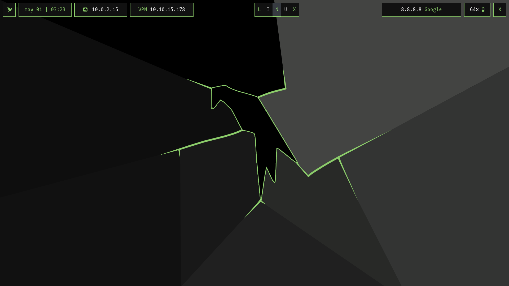

# Dotfiles para Arch Linux

Mi humilde personalización para Arch Linux.

Me basé en el tema Parrot del repo de [ZLCube/AutoBspwm](https://github.com/ZLCube/AutoBspwm).

## Entorno



## Herramientas

Las principales herramientas que conforman el entorno son:

- xorg
- bspwm
- sxhkd
- polybar
- kitty
- yazi
- feh
- bash
- vim
- yay
- firefox

## Set Target - cet
El script que permite **establecer la ip y el nombre del objetivo** se llama **cet**.

```bash
cet [ip_objetivo] [nombre_objetivo]
```

Para borrar los datos del objetivo, basta con agregar la opción `-c`.

```bash
cet -c
```

## TODO
- [ ] Terminar la función para la barra **sistema**.
    - **Posibles funciones:**
        - Mostrar el **número de paquetes a actualizar** en el sistema.
        - Al hacer clic en la barra se despliega un **menú** desde el cuál puedo gestionar **el sonido, el brillo** y algo más.

- [ ] Añadir el .vimrc
